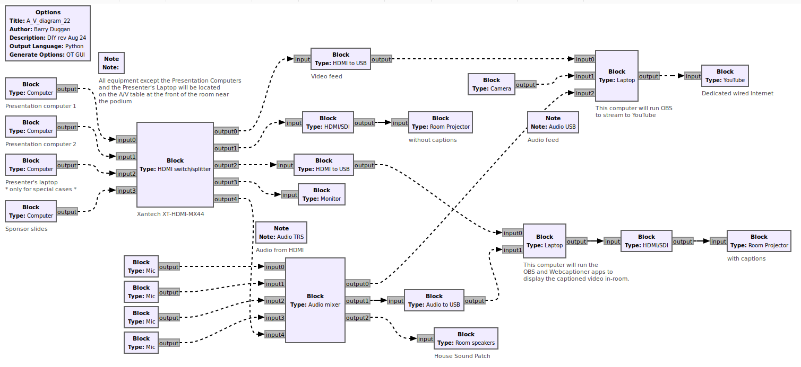

# gr-Draw
This module utilizes the drawing capabilities of GNU Radio's gnuradio-companion to create generic blocks and connect them into a diagram. **The resultant diagram does not do anything.** It is strictly for the visual diagram itself.

Updated for GNU Radio 3.10

## Installation

1. Open a terminal window.
2. Change to the home directory.  
```
cd ~/  
```
3. If you don't have 'git', enter  
```
sudo apt install git  
```
4. Clone the repository:  
```
git clone https://github.com/duggabe/gr-Draw.git
```
5. Execute the following instructions:  

    cd ~/gr-Draw  
    mkdir build  
    cd build  
    cmake ../  
    make  
    sudo make install  
    sudo ldconfig  

## Operation

1. Open a terminal window.
2. Go to the gr-control folder.  
```
cd ~/gr-Draw
```
2. Execute gnuradio-companion.  
```
gnuradio-companion
```

The drawing block will be in the Block Tree panel under Draw. Each Block can have any number of inputs and outputs selected in Parameters.

Here is a sample diagram used to design the A/V for GRCon22:




